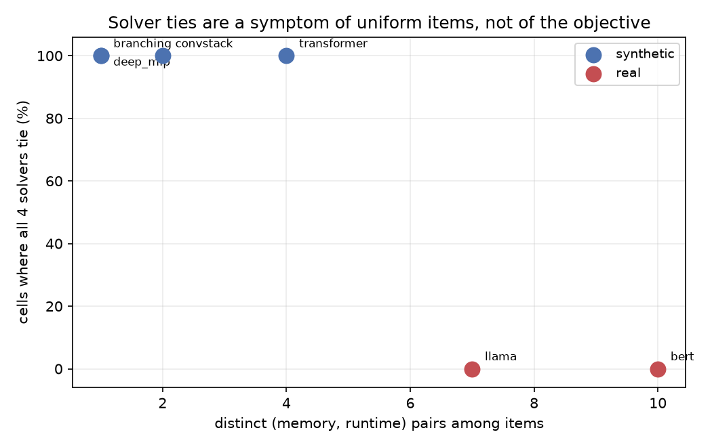

# ackaudit: auditing PyTorch's activation-checkpointing knapsack solvers

Measurement infrastructure for PyTorch's activation-checkpointing planner, plus a
negative result about it.

**Short version.** The hypothesis was that PyTorch's checkpointing objective is
badly underdetermined: that many different plans score identically while using
very different amounts of memory, which would make solver exactness pointless.
On synthetic graphs this looked strong. On real transformers it does not hold.
Once the harness computes item runtimes correctly, ties between solvers
disappear entirely and the gap between the objective and the simulated peak is
around 10%.

Two bugs turned up along the way. One is upstream in PyTorch and is filed. One
was ours, and it was producing the finding.

---

## What the tool does

`min_cut_rematerialization_partition` decides which activations to keep and which
to recompute by solving a 0/1 knapsack. Each recomputable node is an item
weighing its own tensor size, valued at the runtime it saves. Four solvers ship
in `torch/_functorch/_activation_checkpointing/knapsack.py`: `greedy`, `ilp`,
`dp`, and `dp_knapsack_sliding_hirschberg`.

This harness hooks the partitioner at its solver call via `CustomKnapsackSolver`,
a documented extension point, so no fork is needed. It captures the real knapsack
instance, runs every solver across a budget sweep, and scores each resulting plan
two ways:

| objective | how it's computed | who uses it |
|---|---|---|
| **proxy** | `sum(size of saved nodes)` | what the solvers optimise |
| **true**  | simulated backward pass incl. recomputation chains | `account_for_backward_pass=True`, off by default |

Both come from PyTorch's own `KnapsackEvaluator`. The second is never exercised
by PyTorch's evaluation path, since
`evaluate_distribution_of_results_for_knapsack_algo` doesn't pass the flag.

Everything runs on CPU. `torch.compile` traces and partitions without executing a
kernel.

## Setup

```bash
python3 -m venv .venv
source .venv/bin/activate          # Windows: .venv\Scripts\activate
pip install -e ".[dev,hf]"
python -c "import torch; print(torch.__version__)"
```

## Running

```bash
# synthetic graphs: deep chain, branching, transformer block, conv stack
python scripts/run_audit.py --outdir out

# real architectures from transformers configs (random weights, no hub download)
python scripts/run_hf.py --outdir out_hf --models llama bert

# inspect the tied plans in the cell with the worst true-peak spread
python scripts/inspect_cell.py --outdir out

# refresh the README results section and figure from the raw output
python scripts/update_readme.py
```

Runs re-exec themselves with `PYTHONHASHSEED=0` and pin the simulated backward
schedule (`--schedule default|lexicographic|fx_order`, default `fx_order`). Both
are necessary for reproducibility; see [Bugs found](#bugs-found). Two identical
runs give 0/160 differing results.

## Results

<!-- RESULTS:START -->

torch 2.14.0+cu130, CPU, `schedule=fx_order`, `PYTHONHASHSEED=0`.
Generated by `scripts/update_readme.py`; do not edit between the markers.

|  | synthetic | llama + bert |
|---|---|---|
| graphs | 4 | 2 |
| n items | 11 to 31 | 40 to 48 |
| measurements | 160 | 80 |
| median proxy error | +17.4% | **+9.6%** |
| plans where the objective is exact | 46% | 29% |
| plans over 10% error | 52% | 48% |
| **cells where all 4 solvers tie** | **100%** | **0%** |
| median tied true-peak spread | 10.1% | 0.0% |
| max tied spread | 84.6% | 0.0% |



**Item heterogeneity is what decides it.** Real models have varied item
sizes and runtimes; the synthetic graphs here do not, by construction.

| graph | n | distinct mem | distinct rt | distinct pairs |
|---|---|---|---|---|
| `branching` | 31 | 1 | 1 | 1 |
| `deep_mlp` | 24 | 1 | 1 | 1 |
| `convstack` | 11 | 1 | 2 | 2 |
| `transformer` | 15 | 3 | 3 | 4 |
| `llama` | 40 | 6 | 4 | 7 |
| `bert` | 48 | 8 | 4 | 10 |

**Input scale and solver cost.** The partitioner clamps `memory_budget` to
`[0, 1]` and the solver hardcodes `S = 10000`, so the quantised capacity `W`
has a structural ceiling of 10,000. Observed max W = 5000, largest
`dp_knapsack` table 0.98 MB. Median solver wall time on
llama + bert:

| solver | median |
|---|---|
| `greedy` | 0.05 ms |
| `ilp` | 6.0 ms |
| `dp` | 54.9 ms |
| `dp_sliding_hirschberg` | 153.0 ms |

<!-- RESULTS:END -->

### The negative result

On real transformers the solvers never all agree on the same proxy optimum, and
where partial ties occur they carry no spread in true peak. The objective
distinguishes between plans.

The reason is visible in the degeneracy table. Item heterogeneity is what
matters, and real models have it:

```
  graph        n  distinct mem  distinct rt  distinct pairs
  bert#0      48             8            4              10
  llama#0     40             6            4               7
  branching#0 31             1            1               1
  deep_mlp#0  24             1            1               1
```

The synthetic graphs have uniform items by construction, which is exactly what
produces ties. That is a property of models this repo defines, not of anything
in the wild.


### What does survive, with a caveat

`deep_mlp` at budget 0.3: 24 items with identical memory (0.021622) and identical
runtime, so any 13 of 24 is optimal, roughly 2.5 million optima. All four solvers
reach proxy = 0.281081. `ilp` achieves a true peak of 0.281081; the other three
reach 0.518919, an 84.6% spread among plans the objective calls identical.

`scripts/inspect_cell.py` shows the mechanism: `greedy`, `dp` and `hirschberg`
save the head of the chain (indices 0 to 12) while `ilp` saves the tail (11 to
23). Saving the tail is better because recomputing an early node is a short walk
from the input, while recomputing a late node forces every unsaved predecessor to
be live at once. The proxy counts only bytes saved, so it cannot see this.

`ilp` is not smarter here, it is lucky. Nothing in the formulation prefers the
tail.


The dashed line is the objective every solver optimises; it tracks the budget as
intended. The solid lines are the simulated peaks. For `greedy`, `dp` and
`hirschberg`, which coincide exactly, the real peak sits near 0.52 no matter what
budget is requested. Tightening the budget from 0.5 to 0.05 changes the score by
an order of magnitude and the simulated memory not at all.

The caveat: this graph is 24 identical layers because that is how it was written.
The effect is real and reproduces exactly across machines, but it demonstrates
what *can* happen under perfect degeneracy, not what does happen in practice.

### Input scale

The COLM 2026 paper introducing `dp_knapsack_sliding_hirschberg` benchmarks at
`W` between 1.4e8 and 3.8e8 and reports `dp_knapsack` running out of memory at
n = 100 on 64 GB, four to five orders of magnitude above what this pipeline
produces. At realistic scale the new solver is 2 to 3x *slower* than
`dp_knapsack` at realistic scale, not 25 to 28% faster; see the solver table above.


## Bugs found

**Upstream, filed.** `evaluate_knapsack_output(account_for_backward_pass=True)`
is nondeterministic across processes. The simulator linearises the graph with
`nx.topological_sort`, which is non-unique and whose tie-breaking depends on node
insertion order; insertion order comes from a Python set of node names, so it
varies with the hash seed. Identical graph hash, three different peaks across
eight processes. See `docs/UPSTREAM_BUG.md`.

A second, deeper question is described there but not yet filed: peak memory is
schedule-dependent, and the evaluator picks a schedule it never defines. On the
same graph and saved-node set, `nx.topological_sort` gave 0.8387 and
`lexicographical_topological_sort` gave 0.3548. Both are valid orders. Settling
that needs a comparison against a measured backward pass.

**Ours, fixed.** `_runtimes_for` called `estimate_runtime` from inside the solver,
which runs under `no_dispatch()`, so flops mode executed ops on real tensors
instead of fake ones. This crashed BERT on embedding lookups and returned
near-uniform runtimes everywhere else. Uniform item values are what made every
solver tie. `RuntimeRecorder` now captures the values the partitioner computes
outside that block. Llama went from 1 distinct runtime value to 4, and all-tied
cells went from 80% to 0%.

That second bug produced the original finding. It is documented here rather than
quietly corrected, because the corrected numbers are the point.

## Open issues

- **ViT captures zero knapsack instances.** It compiles, but the partitioner
  never reaches the solver. If real vision models never hit this path, that is a
  scope limit rather than a bug.
- **Scale untested.** Only 4-layer models, n up to 48. Whether heterogeneity
  keeps rising with depth is unmeasured.
- **`q3_exactness` in `analyze.py` is unsound** and should be removed. It reports
  which solver "wins", but with cells fully tied the winner is decided by
  iteration order. Use `tie_sets()`. Kept only so older reports stay
  reproducible.
- **"True peak" is a simulation**, not a measured allocator high-water mark.
  Validating against `torch.cuda.max_memory_allocated()` is the one step that
  needs a GPU, and it decides whether any of this corresponds to reality.
- **`aot_eager` backend only.** Fusion under `inductor` changes which nodes are
  recomputable.
- `run_hf.py` writes a report even when zero graphs are captured.

## Layout

```
ackaudit/
├── audit.py       AuditingSolver hook, RuntimeRecorder, dual-objective sweep
├── capture.py     synthetic model zoo + torch.compile driver
├── hf_models.py   transformers architectures built from config
├── schedule.py    pins the simulated backward schedule (A/B/C)
├── figures.py     the one README figure
├── _hashseed.py   re-exec with PYTHONHASHSEED=0
├── analyze.py     summary statistics, heterogeneity and tie-set diagnostics
└── plots.py       figures
scripts/
├── run_audit.py     synthetic sweep
├── run_hf.py        real-architecture sweep + degeneracy check
├── update_readme.py regenerates the Results section and figure from out/
└── inspect_cell.py  dump tied plans for one (graph, budget) cell
docs/
└── UPSTREAM_BUG.md  writeup of both upstream issues
```
